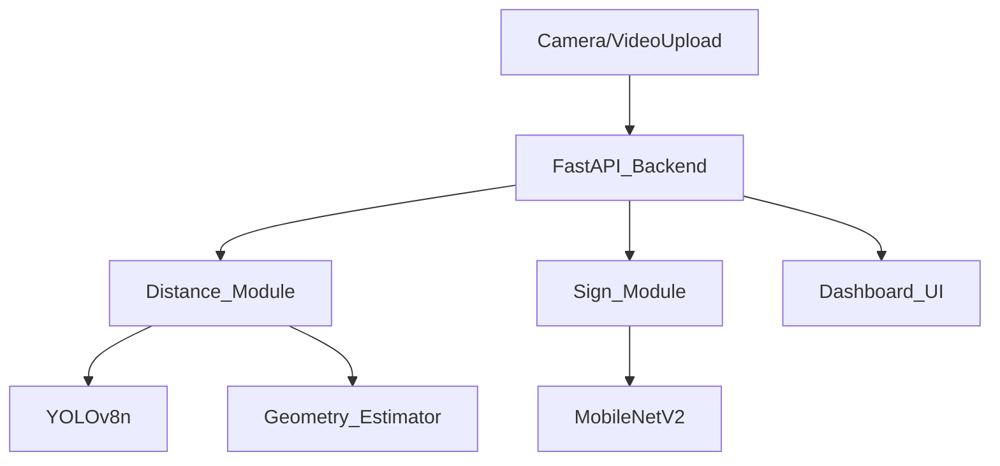

# DriveSense AI – Autonomous Perception Prototype

## Overview
DriveSense AI is a dual-module CPU-optimized perception prototype that simulates autonomous vehicle vision. It estimates the distance to other vehicles and recognizes traffic signs in real-time.

## Modules
1. **DistanceSense Vision:** Uses YOLOv8n to detect vehicles and estimates the distance using monocular geometry based on perceived vs. real-world width.
2. **SignSight Vision:** Uses a MobileNetV2-based transfer learning model to classify 15 major traffic signs from the GTSRB dataset.

## System Architecture

## Running Instructions
1. Navigate to the project directory: `cd drivesense_ai`
2. Install dependencies: `pip install -r requirements.txt`
3. Run the FastAPI server: `uvicorn backend.main:app --reload`
4. Access the futuristic dashboard at `http://localhost:8000`

## Optimization
- CPU-optimized with `torch.no_grad()` and `model.eval()`.
- Implements frame-skipping and resolution scaling to maintain FPS on lower-end hardware.
